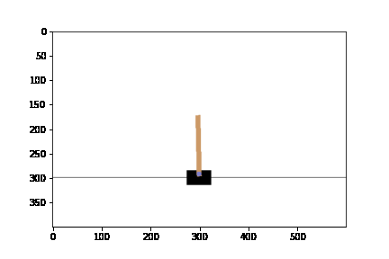
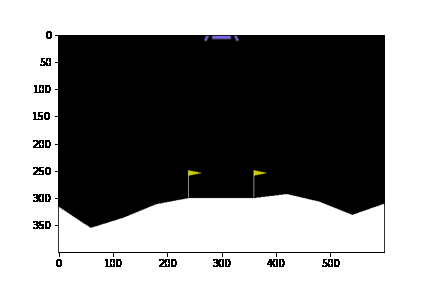
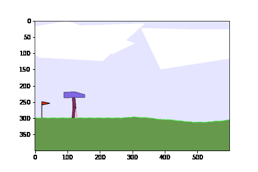

# EvoPolicy

This package solves reinforcement learning problems using evolutionary strategeies as outlined in [Evolution Strategies as a Scalable Alternative to Reinforcement Learning](https://arxiv.org/abs/1703.03864)

These methods only seem to work with stochastic policies. Stochastic policies implemented include:

- Categorical - select one action with probability p_i
- Normal - n dimensional output parameterized by mu and log(sd) vectors
- MVNormal with Covariance - n dimensional output with mu and covariance parameters (the upper triangle matrix of cholesky decomposed precision matrix)
- Dirichlet - n dimensional output summing to one (this is not the same as softmax, it is stochastic)

# Polyp Networks

Available networks include a **Polyp** network which grows the number of hidden nodes
from an initial single node.

# Files

**.solver.py**

Solver contains the class EvoSolver which is used to interact with an environment following OpenAI's gym api. Interactions with the environment are used to train a neural network that models a policy. The EvoSolver can then be used to select an action based on a state.

**.network.py**

This contains the neural network which models the policy. You should not need to interact with the network directly, instead use the EvoSolver.

# Example

example_cartpole.py contains example usage with the polecart environment.

example_lunarlander.py contains example usage with the lunar lander continuous environment.

example_bipedalwalker.py contains example usage with the bipedal walker environment.

# Requirements

Developed with pyton==3.6.9

Install requirements with:
> pip install -r requirements.txt